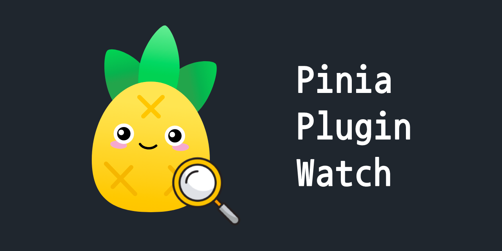

# 🍍 pinia-plugin-watch

[](https://www.npmjs.com/package/pinia-plugin-watch)   [](./CHANGELOG.md)

[](https://github.com/Gumball12/pinia-plugin-watch/actions/workflows/ci.yaml) [](https://github.com/Gumball12/pinia-plugin-watch/actions/workflows/publish.yaml) [](https://codecov.io/gh/Gumball12/pinia-plugin-watch)



A plugin that allows you to monitor and react to changes in your store's state deeply.

Supports Pinia v2. (Vue 2 and 3)

## 🚀 Quick Start

### 1. Install the plugin

```bash
npm i pinia-plugin-watch
yarn add pinia-plugin-watch # for yarn
pnpm add pinia-plugin-watch # for pnpm
```

### 2. Add the plugin to Pinia

```ts
import { createPinia } from 'pinia';
import { WatchPiniaPlugin } from 'pinia-plugin-watch';

const pinia = createPinia();
pinia.use(WatchPiniaPlugin);
```

### 3. Use the plugin

```ts
import { defineStore } from 'pinia';

const useStore = defineStore('store', {
  state: () => ({
    count: 0,
    user: {
      name: 'John',
      age: 20,
    },
  }),

  // PiniaPluginWatch
  watch: {
    count: (newValue, oldValue) => {
      console.log('count changed', newValue, oldValue);
    },

    user: {
      handler: (newValue, oldValue) => {
        console.log('user changed', newValue, oldValue);
      },
      children: {
        name: (newValue, oldValue) => {
          console.log('user.name changed', newValue, oldValue);
        },
      },
    },
  },
});
```

## 📖 Usage

> For other usage, please refer to the [test code](./__tests__/index.test.ts).

### Watch for non-nested states

Define an object with the name of the state property you want to watch as a key and the handler as a value in the `watch` option.

```ts
const useStore = defineStore('store', {
  state: () => ({
    count: 0,
  }),

  watch: {
    // Watch `count`
    count: (newValue, oldValue) => {
      console.log('count changed', newValue, oldValue);
    },
  },
});
```

### Watch for nested states

Similarly, define an object with the name of the state property you want to watch as a key and the handler as a value in the `watch` option.

```ts
const useStore = defineStore('store', {
  state: () => ({
    user: {
      name: 'John',
      age: 20,
    },
  }),

  watch: {
    // Watch `user`
    user: (newValue, oldValue) => {
      console.log('user changed', newValue, oldValue);
    },
  },
});

const store = useStore();

// "user changed"
store.user = {
  name: 'Jane',
  age: 20,
};

// "user changed"
store.user.name = 'Jane';
```

The `user` Watch handler defaults to tracking changes to the `user` and the properties(`user.name`, `user.age`) under it.

If you don't want to track subproperties, pass the `deep` option to `false`:

```ts
const useStore = defineStore('store', {
  state: () => ({
    user: {
      name: 'John',
      age: 20,
    },
  }),

  watch: {
    // Watch `user`
    user: {
      deep: false, // Don't track subproperties
      handler: (newValue, oldValue) => {
        console.log('user changed', newValue, oldValue);
      },
    },
  },
});

const store = useStore();

// "user changed"
store.user = {
  name: 'Jane',
  age: 20,
};

// nothing
store.user.name = 'Jane';
```

If you want to define Watch handlers for child properties, use the `handler` and `children` properties:

```ts
const useStore = defineStore('store', {
  state: () => ({
    user: {
      name: 'John',
      age: 20,
    },
  }),

  watch: {
    user: {
      deep: false,
      // Watch `user`
      handler: (newValue, oldValue) => {
        console.log('user changed', newValue, oldValue);
      },
      children: {
        // Watch only `user.name`
        name: (newValue, oldValue) => {
          console.log('user.name changed', newValue, oldValue);
        },
      },
    },
  },
});
```

Note: The `children` and `handler` properties are not available in a non-nested state.

### Using the Setup Store

You can use it in the Setup Store method in the same way.

```ts
const useStore = defineStore(
  'store',
  () => {
    const count = ref(0);
    const user = ref(
      reactive({
        name: 'John',
        age: 20,
      }),
    );

    return {
      count,
      user,
    };
  },
  {
    watch: {
      count: (newValue, oldValue) => {
        console.log('count changed', newValue, oldValue);
      },
      user: {
        handler: (newValue, oldValue) => {
          console.log('user changed', newValue, oldValue);
        },
        children: {
          name: (newValue, oldValue) => {
            console.log('user.name changed', newValue, oldValue);
          },
        },
      },
    },
  },
);
```

### `$watch` Store property

You can reference the Watch handler defined through the `store.$watch` property.

```ts
const store = useStore();

store.$watch.count; // Watch handler for the `count` state
store.$watch.user.name; // Watch handler for the `user.name` state
```

## 🌮 API

### `options.watch`

- Type: `Record<string, WatchHandler | WatchOptions>`

### `WatchHandler`

- Type: `<T>(newValue: T, oldValue: T) => void`

### `WatchOptions`

- Type: `Record<string, WatchHandler | WatchOptions>`
- Properties:
  - `handler`: `WatchHandler`
  - `children?`: `Record<string, WatchHandler | WatchOptions>`
  - `deep?`: `boolean` (default: `true`)

### `store.$watch`

- Type: `typeof options.watch`

The `watch` option is copied to the `$watch` property of the store.

## 🪪 License

[MIT](./LICENSE)
